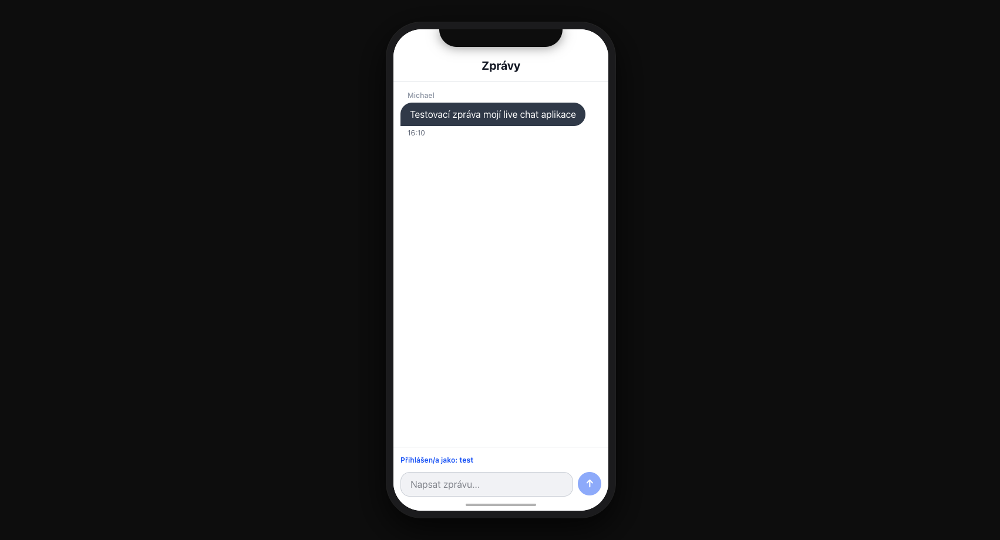

# Message Board

Live messaging board application with an iPhone-style chat interface and real-time updates.

[Live project](https://messages.michaelptacek.com)



## Techstack 
* **Frontend**: React, Next.js, TailwindCSS
* **Backend**: Node.js, TypeScript
* **Database**: PostgreSQL, Prisma ORM
* **Real-time**: Socket.io
* **Containerization**: Docker, Docker Compose

## Features
* iPhone-style chat design
* Real-time messaging
* User name persistence
* Responsive layout for mobile and desktop
* Auto-scroll to newest message

## How to install and run this project
Make sure you have [Node.js](https://nodejs.org/) and [Docker](https://www.docker.com/) installed.

### Option 1: With Docker (recommended)
1. Clone this repository
2. Start the application:
```bash
docker-compose up
```
3. Open [http://localhost:3000](http://localhost:3000) in your browser

### Option 2: Manual setup

**Backend:**
```bash
cd backend
npm install
npm run dev
```

**Frontend (in another terminal):**
```bash
cd frontend
npm install
npm run dev
```

4. Open [http://localhost:3000](http://localhost:3000) in your browser

## Project Structure
```
message-board/
├── backend/              # Node.js/TypeScript backend
│   ├── index.ts          # Main server file
│   ├── package.json
│   └── prisma/
│       └── schema.prisma # Database schema
├── frontend/             # Next.js/React frontend
│   ├── app/
│   │   ├── components/
│   │   │   ├── MessageForm.tsx
│   │   │   └── MessageList.tsx
│   │   ├── hooks/
│   │   │   └── useMessages.tsx
│   │   ├── globals.css
│   │   ├── layout.tsx
│   │   └── page.tsx
│   └── package.json
└── docker-compose.yml
```

made by [Michael Ptáček](https://michaelptacek.com)

